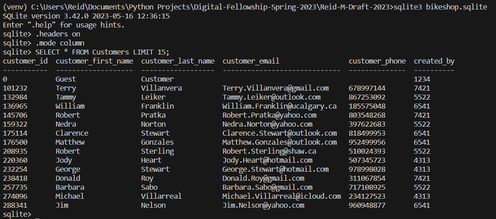
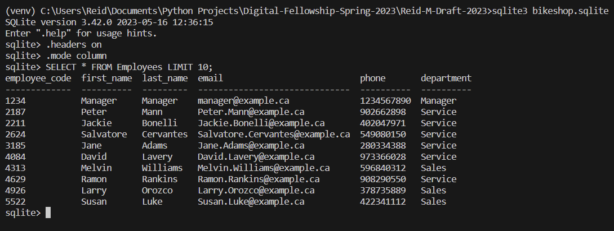
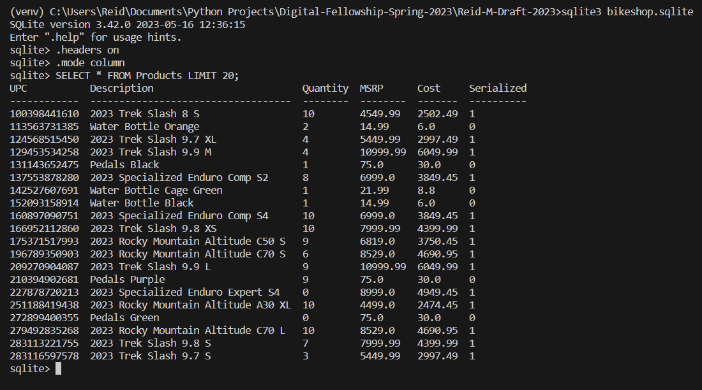

# Why SQL?

## By: Reid Moline

In my first few years of Python learning, the comma seperated value file reigned supreme as a means of storing and accessing data to be manipulated and visualized. In my second year digital engineering course ENDG 311, I was introduced to Structured Query Language, or SQL, as an alternative means of accessing data from relational databases. More specifically, I was introduced to the python compatible, serverless application SQLite. In this introduction, I learned the basics behind SQLite and used this to create a small scale databases to store and manipulate data.

Although I was introduced to a new way of storing and accessing data, the small scale nature of the projects made me wonder what was ever wrong with the simplicity and ease of using CSVs. It was this confusion that lead me to ask, "Why in the world would I use SQL?", and as such warranted further digging. Alligning with Professor David Perkin's seven principles of learning seen in the 2008 book, Making Learning Whole: How Seven Principles of Teaching Can Transform Education, I plan to "make the game worth playing" by diving deeper into the real world applications and usefullness of Structured Query Language along with concepts of data visualization learned in digital engineering courses, looking to answer the over arching question, "Why SQL?"

Before taking this dive further into SQL and SQLite, let us first review go over some basic SQL queries and background. For some, this may be completely new, and for others this may be a brief refresher, all in all this part looks to catch you up to speed with the SQL taught in ENDG 311.

## Some Background and a Review of SQLite

SQL is a way in which we can access data stored in a relational database. By relational database, I am reffering to a network of numerous structured tables that are related to one another via a common column which serves as what is known as the primary key. For this database structure to work, these primary keys must be unique to each row inputted into the table. For example if we were to have a relational database of all students attending UofC, a UCID would be a great column for a primary key as no two students share the same UCID.

To access and manipulatee data stored in these databases, we use SQL queries, which are statements that utilize keywords to preform certain operations. In a very general way, these operaitons are CRUD operations seen in the table below:

In SQL there are numerous keywords reserved to preform specific operations on data set forth in a relational database. For reference, a list of a few keywords and example uses has been attached below:

    * CREATE - Creates a Table with outlined column titles
        i.e CREATE TABLE table_name(column_1 primary key, column_2 type)
    * SELECT - Used to access certain columns from a table
        i.e SELECT * FROM table_name
    * WHERE - Used to find data based on conditional statements i.e WHERE value > 6
        i.e SELECT * FROM table_name WHERE id = 2
    * INSERT - Adding rows to a table 
        i.e INSERT INTO table-name (the values coresponding to each column)
    * UPDATE - Used to update an entry
        i.e UPDATE table-name SET column-name = value1 WHERE column-name = value2
    * DELETE - Used to delete an entry
        i.e DELETE FROM table-name WHERE column-name = value
    * DROP  - Used to delete a table
        i.e DROP TABLE table-name

NOTE: These keywords are not case sensitive, rather are capitalized to emphisize that they are keywords

Much like Python has datatypes, SQLite also has certain datatypes that can be seen in the following link: https://www.sqlite.org/datatype3.html

## Using SQLite

For many, SQLite may comes prepackaged with Python, however for some like myself, this is not the case. To test this out feel free to open up a command prompt in your IDE and type into your terminal "sqlite3". The resulting output should look something like the following:

If this isn't the case, then head over to www.sqlite.org and head to the downloads tab. From there find the respective precompiled binaries for your respective operating system, download them and place them in the same folder python is installed in. To check where python is in your file explorer type "where python" into your command prompt.

To exit the SQLite terminal type in .exit. SQLite terminals have many other "dot" commands to perform certain funcitons all listed in the documentation below: https://sqlite.org/cli.html. The sqlite3 terminal serves as a useful way to query a database that was altered in a python file to see the outcome, hence I reccomend trying out some queries in the terminal. NOTE: all queries in the terminal must be followed by a semi colon to be executed. 

Now with SQLite installed and ready to go, we can execute SQL queries within a python document by importing sqlite3 and setting up two things; a connection and a cursor. The connection and cursor serve to connect the python document to the database and to be able to execute SQL queries on said database. An example of a simple interaction to open a new sqlite database file named introduction.sqlite and create a table called students is attached in the python document sqlite-intro.py. 

With this simple one table database I encourage you to practice getting comfortable with some of the basic SQL queries listed earlier and even try branching out to use other keywords such as LIKE, AND, OR, NOT, or even try ORDER BY and built in functions like max(), min(), avg(), sum(), and count().

With this intro into SQL using only a single table database I couldn't help but think, "Why not just use a CSV? What is the point of SQL?". To answer this question lets move forward into a motivating example relavent to a real world system.

NOTE: I found it helpful to install the VSCode extension SQLite Viewer by Florian Klampfer to be able to click on and view the contents of .sqlite files.

## Motivating Example

For this motivating example, I looked to create a scenario around a hobby of mine; bikes, and more specifically around the backend behind the business logic of a bike shop. In this I not only look to look deeper into SQL but also to "make the game worth playing" by looking into an actual real world scenario. Lets say you are the store manager of the Calgary Bike Shop and need a system to process transactions and record transactions with customers and track sales metrics. If we were to generate a mock of what this table would look like using the code in motivating-example-large-table-generator.py, it would look something like the following:

With this very over simplified table of one item transactions, a flaw begins to arrise by changing the constant NUM_SALES to a larger number to mimic a busy sales day. In doing this, a simple 9 column table becomes super long and as such becomes more difficult to sift through for data. Furthermore, this table only considers simple one item transactions of a business; not taking into account transactions with more than one item. On top of that, there is way more information we can include about products, employees, and customers that if added would make this table huge! If we were to continue to add all of this to one table and format it as a CSV, it would be a horrendously large and jumbled up array of data. This is where a relational database structure can help.

Focussing only on the retail transactions and stock side of the business, we can begin to seperate the portions of a transaction into four seperate categories; the customer, the salesperson, the transacitons, and the products. Although all four of these things are seperate entities, they all relate to each other in one way or another. In formatting four seperate tables for these items it can allow for us to organize a better system for storing transaction records.

First off we can start with creating a table for customers. Given people can have the same full first and last name it would make sense to create a numeric customer ID to create different profiles. With this we can include basic information that can help the business, such as their first name, last name, email, and phone number. Using the code in customers.py we can create a mock up table of customer profiles like the one below:

In the code customers.py, notice that I included the query:

    cursor.execute("SELECT * FROM Customers WHERE customer_email IS NULL")

In this table, notice how I made the first entry, Customer ID 0, be all NULL values (like Python None values). I reserved this to be a guest customer profile, for in real world application not every customer would want to be entered in the system and as such this would allow transactions to occur with no customer profile. Furthermore some may opt-in to everything but giving their email like Customer ID 49. You can check this using the sqlite3 terminal by typing the following in the command prompt:

    sqlite3 bikeshop.sqlite
    SELECT * FROM Customers WHERE customer_email IS NULL;

Or you can access a list of all row tuples where this is the case using these lines of code into customers.py:

    cursor.execute("SELECT * FROM Customers WHERE customer_email IS NULL")

    all_rows_with_no_email = cursor.fetchall()

Moving on from this to the creation of an Employee table seen in the file employees.py. For a basic record of all employees I have included an employee id, first name, last name, work email, and phone number. The table generated using the code in employees.py is of the following form:

Now we can generate a table for the products in store. Keeping it somewhat small, given all products are being generated by myself in products.py, For the products, I made it so that each product will have it's own 12 digit universal product code (UPC), a description of the product, the quantity of the product on hand, the vendor which the product is ordered from, the manufactuer's suggested retail price (MSRP), the business cost of the unit. With this all considered, using the code in the file products.py, the generated table is of the following form:

NEXT: Handling transactions