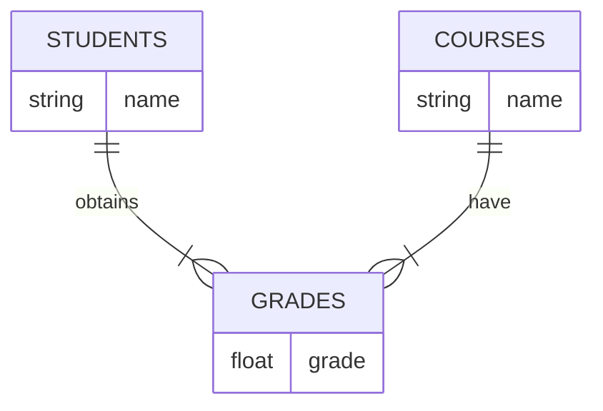

# Table relationships
## Entity Relationship Diagram


The above entity relationship diagram can be created in sqlite using the following sql commands:

```sql
CREATE TABLE students(
    student_id integer not null primary key, 
    name varchar);

CREATE TABLE courses(
    course_id integer not null primary key, 
    name varchar);

CREATE TABLE grades(
    grade_id integer primary key, 
    student_id integer students, 
    course_id integer, 
    grade float, 
    foreign key(student_id) references students(student_id), 
    foreign key(course_id) references courses(course_id));
```

## Inner join
We would like to list all student names and course names and grades.
```sql
SELECT students.name, courses.name, grade
FROM ((grades
INNER JOIN students ON grades.student_id = students.student_id)
INNER JOIN courses ON grades.course_id = courses.course_id);
```

https://www.w3schools.com/sql/sql_join_inner.asp


Average grade for every student (across courses):
```sql
SELECT students.name, AVG(grade)
FROM (grades
INNER JOIN students ON grades.student_id = students.student_id)
GROUP BY grades.student_id;
```

Courses for each student we have grades for
```sql
SELECT students.name, group_concat(DISTINCT courses.name)
FROM grades
INNER JOIN students ON students.student_id = grades.student_id
INNER JOIN courses ON courses.course_id = grades.course_id
GROUP BY students.student_id;
```

## Foreign keys
Make sure to `sqlite>pragma foreign_keys=ON;` to enable foreign key constraint.

https://sqlite.org/foreignkeys.html

## Alter table
SQlite supports changing a table name, renaming a column and adding a column with `ALTER TABLE`:

https://www.sqlitetutorial.net/sqlite-alter-table/

Removing a column is a bit more involved. The above tutorial explains the steps.

## Dump and read an sql database

https://www.sqlitetutorial.net/sqlite-dump/
```
sqlite>.output grades_extended.sql;
sqlite>.dump;
```

Read sql file: https://database.guide/5-ways-to-run-sql-script-from-file-sqlite/

## More to explore
A spotify-like practice database and sqlite tutorial:  
https://www.sqlitetutorial.net/

Python sqlite tutorial:  
https://realpython.com/python-sqlite-sqlalchemy/
